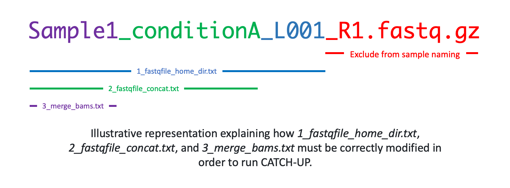

# Bulk ChIP and ATAC sequencing upstream analysis


<p align="center">
  


### Note:
- This pipeline works with both single- and paired-end FASTQ data.
- This pipeline will run all the analyses in this folder. Within `config/analysis.yaml`, you can specify where to move all final analysis files and whether intermediate files should be deleted.
- Boolean config values can be written either as YAML booleans (`true` / `false`) or as legacy strings (`"True"` / `"False"`).
- If you need to download and index the reference genome for your analysis, please go to the [reference_genomes](https://github.com/Genome-Function-Initiative-Oxford/UpStreamPipeline/tree/main/reference_genomes) folder.

### Before starting:
FASTQ names have to be in the following format:
```<Sample-name>_<condition>_<lane>_<read>.fastq.gz```

If not in this format, run ```modify_fastq_names.py``` to correct their names. In order to run the script, run as follows:

    python modify_fastq_names.py <path-to-fastq-directory>

### Configuration:
- The `config/analysis.yaml` file contains the main key-value configuration with inline documentation.
- You can provide inputs in one of two ways:
  1. **Modern sample sheet** via `sample_sheet:` in the config file.
  2. **Legacy text files** (`1_fastqfile_home_dir.txt`, `2_fastqfile_concat.txt`, `3_merge_bams.txt`).
- The sample sheet may be TSV or CSV and supports these columns:
  - `fastq_prefix` (required): FASTQ prefix without read suffix or extension
  - `sample_name` (preferred for explicit analysis-level grouping)
  - `merge_group` (preferred for explicit merge grouping)
  - legacy aliases still supported: `concat_sample`, `merge_sample`
- Recommended examples:
  - bundled example sample sheet: [`config/DNase_example.samples.tsv`](./config/DNase_example.samples.tsv)
  - reusable dry-run fixture: [`../../tests/fixtures/catch-up-merge-aware/`](../../tests/fixtures/catch-up-merge-aware)
- If `concatenate_fastq: true`, provide `sample_name` (or legacy `concat_sample`).
- If `merge_bams: true`, provide `merge_group` (or legacy `merge_sample`).

<figure>
  
</figure>

#### Legacy text-file mode

- In `1_fastqfile_home_dir.txt` specify sample names without read numbers and extension (i.e. without `_R1` / `_R2` and `.fastq.gz`). For example, for the following FASTQ files (single-end sample names must end with `.fastq.gz`, while paired-end names must end with `_R1.fastq.gz` / `_R2.fastq.gz`, and they must be stored in the same directory):
    ```
        Sample1_conditionA_L001_R1.fastq.gz
        Sample1_conditionA_L001_R2.fastq.gz
        Sample1_conditionA_L002_R1.fastq.gz
        Sample1_conditionA_L002_R2.fastq.gz
        Sample1_conditionB_L001_R1.fastq.gz
        Sample1_conditionB_L001_R2.fastq.gz
        Sample1_conditionB_L002_R1.fastq.gz
        Sample1_conditionB_L002_R2.fastq.gz
        Sample2_conditionA_L001_R1.fastq.gz
        Sample2_conditionA_L001_R2.fastq.gz
        Sample2_conditionA_L002_R1.fastq.gz
        Sample2_conditionA_L002_R2.fastq.gz
        Sample2_conditionB_L001_R1.fastq.gz
        Sample2_conditionB_L001_R2.fastq.gz
        Sample2_conditionB_L002_R1.fastq.gz
        Sample2_conditionB_L002_R2.fastq.gz
    ```
    In addition, the listed samples must be contained in the folder defined in the *fastq_home_dir* key in ```config/analysis.yaml```). Every line should contain one sample as follows:
    ```
        Sample1_conditionA_L001
        Sample1_conditionA_L002
        Sample1_conditionB_L001
        Sample1_conditionB_L002
        Sample2_conditionA_L001
        Sample2_conditionA_L002
        Sample2_conditionB_L001
        Sample2_conditionB_L002
    ```
    Generalisation of ```1_fastqfile_home_dir.txt``` 
- **If concatenating lanes is required** (set `concatenate_fastq: true` in the config file), in `2_fastqfile_concat.txt` define the FASTQ prefixes to be concatenated. If the sequencing is composed of multiple lanes, the user can specify that they should be concatenated before downstream processing. Every line should contain one sample prefix as follows:
    ```
        Sample1_conditionA
        Sample1_conditionB
        Sample2_conditionA
        Sample2_conditionB
    ```
    (Generalisation of ```3_merge_bams.txt```)
- **If merging of samples is required** (set `merge_bams: true` in the config file), in `3_merge_bams.txt` define the BAM prefixes to be merged. If the sequencing data is composed of replicates or related samples, the user can choose to merge them or keep them separate. Every line should contain one sample prefix as follows:
    ```
        Sample1
        Sample2
    ```
    (Generalisation of ```3_merge_bams.txt```)
- There is an option for adapter trimming, which can be specified in the configuration file. The user must provide the correct adapter sequences.

### Output folders:
- When running the pipeline, ```results```, ```QCs```, and ```logs``` folders will be automatically generated with all related outputs inside the folder (*analysis_name*) specified in the configuration file.

### Example runs
The bundled DNase example uses the modern sample-sheet mode via [`config/DNase_example.samples.tsv`](./config/DNase_example.samples.tsv).
A reusable merge-aware dry-run fixture is also available at [`../../tests/fixtures/catch-up-merge-aware/`](../../tests/fixtures/catch-up-merge-aware).

Using Pixi from the repository root:

```bash
pixi install
PIXI_CORES=2 pixi run catch-up-example
```

Using Snakemake directly from `genetics/CATCH-UP`:

```bash
mkdir DNase_fastq_example
cd DNase_fastq_example
wget https://www.encodeproject.org/files/ENCFF001BOB/@@download/ENCFF001BOB.fastq.gz # download DNase FASTQ example from ENCODE
cd ..
echo ENCFF001BOB > 1_fastqfile_home_dir.txt # create file listing samples
pixi run catch-up-example
```

Reusable fixture dry-run from the repository root:

```bash
pixi run bash -lc 'cd genetics/CATCH-UP && snakemake --configfile=../../tests/fixtures/catch-up-merge-aware/config.yaml -n all --cores 1'
```

### Generating rule plots:
- ```snakemake --configfile=config/analysis.yaml --forceall --dag | dot -Tpdf > dagALL.pdf```
- ```snakemake --configfile=config/analysis.yaml --forceall --rulegraph | dot -Tpdf > dag.pdf```

### Run Snakemake
- Directly with Pixi: `PIXI_CORES=4 pixi run catch-up`
- Directly with Snakemake inside `genetics/CATCH-UP`: `snakemake --configfile=config/analysis.yaml all --cores 4`

### Run on SLURM
- Modify parameters of `submit.sh` (conda-based) or `submit.pixi.sh` (Pixi-based)
- Submit the job with `sbatch submit.pixi.sh`

### Warning:
!!!) Run or submit the job through the terminal system and not inside e.g. jupyter-lab terminal.
